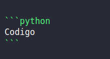
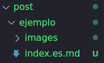
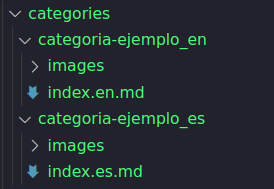

# **Markdown**

# Titulo 1
## Titulo 2
### Titulo 3
#### Titulo 4

```
# Titulo 1
## Titulo 2
### Titulo 3
#### Titulo 4
```

**Letra en negrita**

*Letra en cursiva*

`Subrallado`

```
**Letra en negrita**
*Letra en cursiva*
`Subrallado`
```

---

```python
Codigo
```



* Lista
* Lista
* Lista

```
* Lista
* Lista
* Lista
```

| Columna Izquierda | Columna Derecha | Columna Centrada |
| :--- | ---: | :---: |
| 1 | 2 | 3 |
| 4 | 5 | 6 |
| 7 | 8 | 9 |

```
| Columna Izquierda | Columna Derecha | Columna Centrada |
| :--- | ---: | :---: |
| 1 | 2 | 3 |
| 4 | 5 | 6 |
| 7 | 8 | 9 |
```

[Link](https://google.com)


```
[Link](https://google.com)


```

---

```
---
```

# Estructura de publicaciones

Todas la publicaciones estan dentro de la carpeta post, cada post tiene que tener su carpeta, y dentro tiene que haber otra carpeta para las fotos y el index.md.
El index.md es el archivo principal de la publicación. Para tener el post en varios idiomas se tiene que poner lo siguiente: `index.idioma.md` Ejemplos: `index.es.md`, `index.it.md`, `index.en.md`



## Configuración del post

En todas las publicaciones arriba del todo tienen una seccion separada por "`---`" en la cual se especifican los parametros del post

### Parametros principales

```
---
title: Titulo de la publicación
description: Descripción de la publicación
date: Fecha en formato "2023-02-01"
image: Ubicación de la foto de portada
categories: [Categorias, Categorias]
tags: [Etiquetas, Etiquetas]
author: [author, author]
---
```

### Parametros extras

```
---
readingtime: Flase/True
toc: False/True
---
```

# Categorias

La estructura es muy parecida a la de los posts. Cada categoria tiene que tener su carpeta.



## Configuración categorias

Contenido del index.md de la categoria

```
---
title:  Titulo de categoria
description: Descripción categoria
image: Portada categoria
style:
    background: Color del fondo de la categoria
    color: Color de las letras de la categoria
---
```